# ETS

(still pending group & project name)

## About ETS

ETS gives ease of access for ETS employees to review and create projects and reports sent in by the state's Independent Verification and Validation (IV&V) vendors by standardizing the information sent in by each vendor.

You can read more in the HACC proposal listed [here](https://hacc.hawaii.gov/wp-content/uploads/2025/10/Challenge-Use-Case-2025-ETS-Project-Review-Web-Application.pdf).

## Deployment


Our app's live demo is currently deployed [here](https://pseudo-hacc-ets.vercel.app/), and is hosted by Vercel.

## Maintainers
* [Kyler Ching](https://github.com/kylersm)
* [Courtney Hisamoto](https://github.com/CourtneyHisa)
* [Zhanpeng Lin](https://github.com/zhanpenglin9)
* [Shuto Nishida](https://github.com/shuton-gif)

[*bound by agreement contract*](https://docs.google.com/document/d/1umOiaQro4WNHh2q9xjLKDcvKRWewYVYl2126YHVgowA)

## Tools

Our solution is based upon the [nextjs-application-template](https://github.com/ics-software-engineering/nextjs-application-template). For our stack, we are using:
* NextJS as our React framework
* Typescript for our backend and frontend
* React-Bootstrap for styling
* Prisma for ORM
* ESLint and Prettier for internal readability

## Tracking Our Progress

Our project management is [issue driven](https://courses.ics.hawaii.edu/ics314f25/morea/project-management/reading-guidelines-idpm.html). You can see our issues (tasks) associated with each milestone here:

* [Milestone 1](https://github.com/orgs/oh-yeah-ics-314-final-project-7-lets-go/projects/1): November 5th – November 19th
* [Milestone 2](https://github.com/orgs/oh-yeah-ics-314-final-project-7-lets-go/projects/2): November 19th – December 1st
* [Milestone 3](https://github.com/orgs/oh-yeah-ics-314-final-project-7-lets-go/projects/3): *Planned, for December 1st – December 10th*

## User Guide

This section aims to guide the user through how to use our website. Account creation is accessible to ETS employees only.

The homepage view offers a welcome page to users.

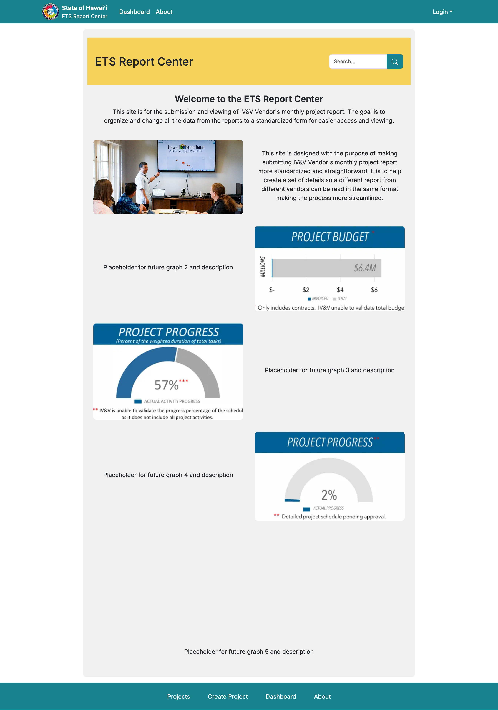

### Project Workflow

Vendors can create a project by following the instructions on the create project page. Their project will immediately be in a pending state so that they can add appropriate issues, events, and monthly reports.

When a project is **approved**, new events or issues can't be created, and existing ones can't be edited. They will only be able to be created/edited when the containing project is in a pending or denied status. 

If a project is **denied**, the vendor should revise or complete information for their project and request a review again.

* Events, issues, and comments do not have their own statuses.
* Comments can be added or edited regardless of project status.
* Vendors will be able to create, edit, and delete their own comments, but ETS employees can delete (but not edit) other users' comments on top of that.

Vendors will also be able to create monthly reports for their project. The data entered should be the progress up to the **end** of that month & year, not the progress made during that time.

* Like projects, reports also have an approval system. If denied, the vendor can also request a review from an employee.

When a report is **approved**, it will not be editable. It can only be edited when in a denied or pending state. Reports can be created or edited regardless of project status.


### Public View
This view is for the general public to see. They will be able to view:
* Search through existing reports and projects 

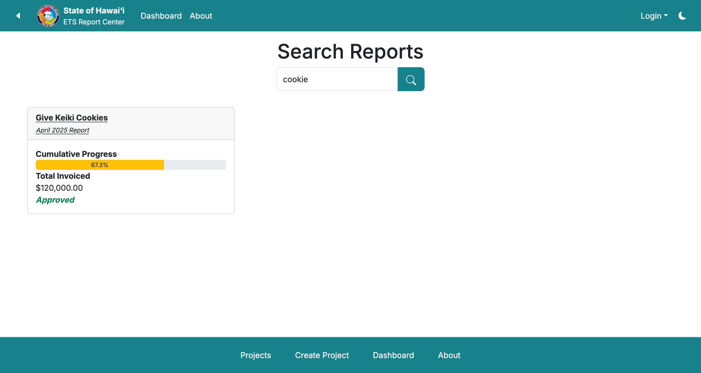

* A list of every project submitted by the vendors. These projects will include progress, budgets, and an overall timeline of the project.

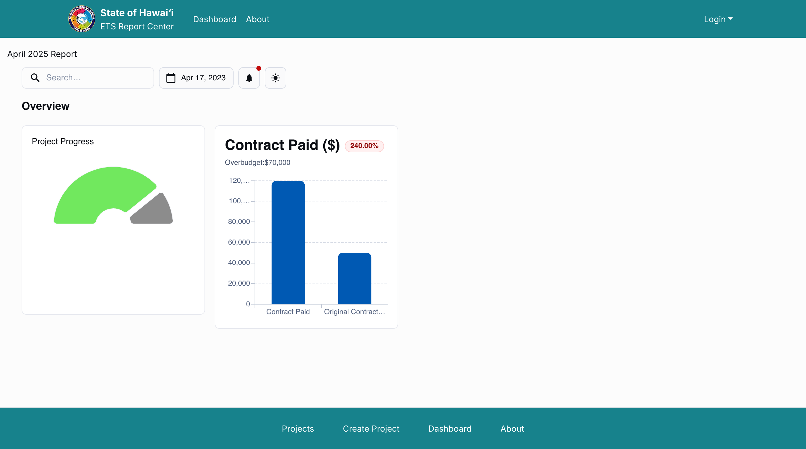

* Users can also log in, given that they are just a vendor or employee that's logged out. Otherwise, users cannot create their own account.

* A dark theme is also offered for lighter viewing.

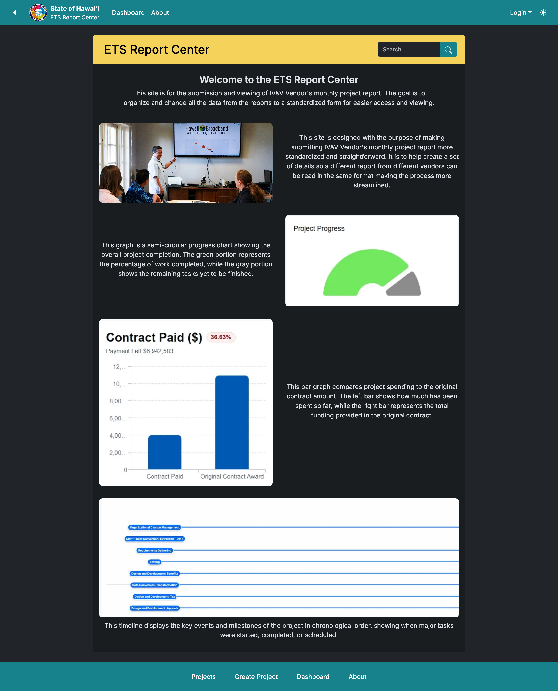

### Vendor View
This view is for the IV&V vendors. They can also see items listed under [public view](#public-view). They will be able to:
* Create and edit projects

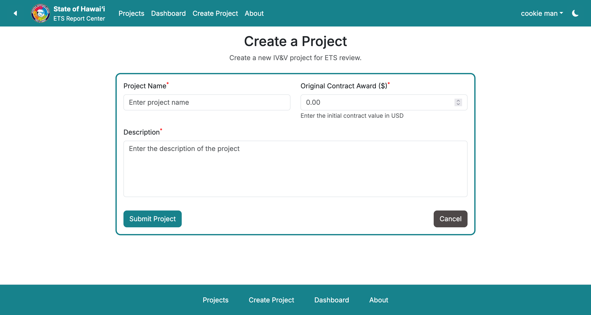

* View a list of projects that they have created

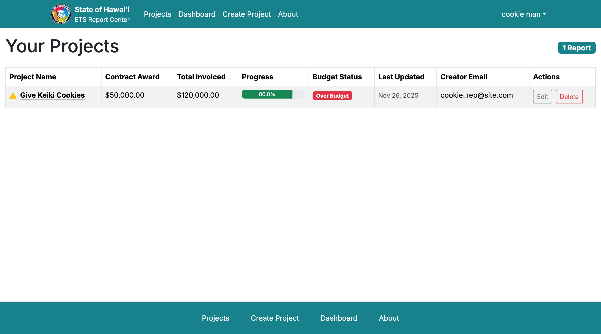

* See the status that their project or reports are in

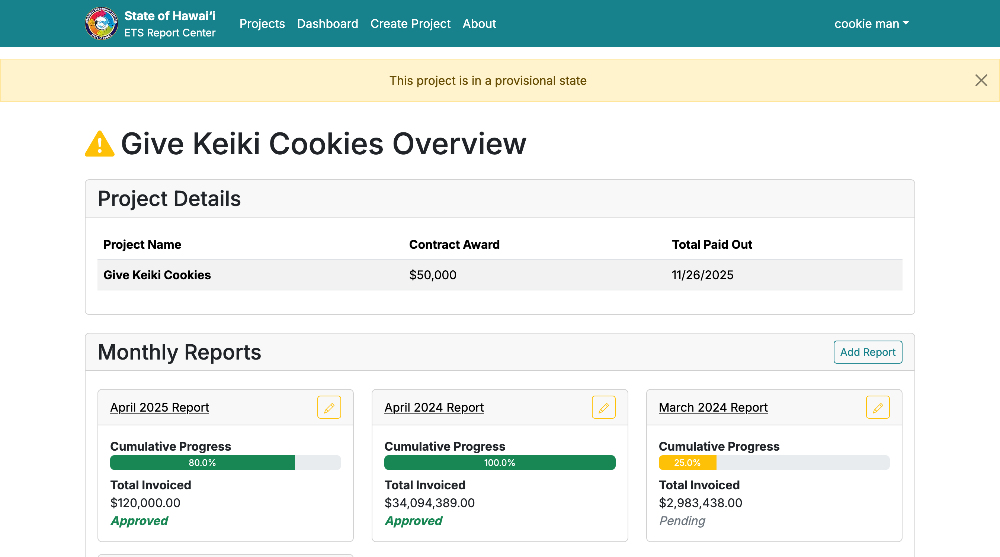
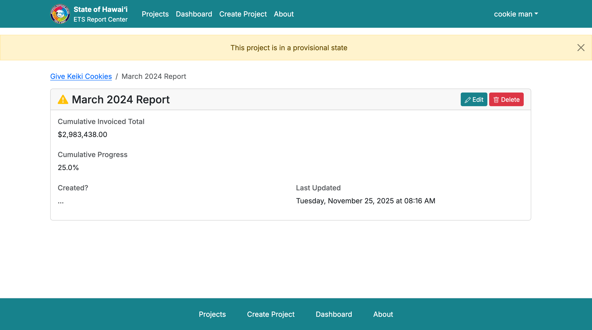

* Append, edit, or delete issues and timeline events to existing projects

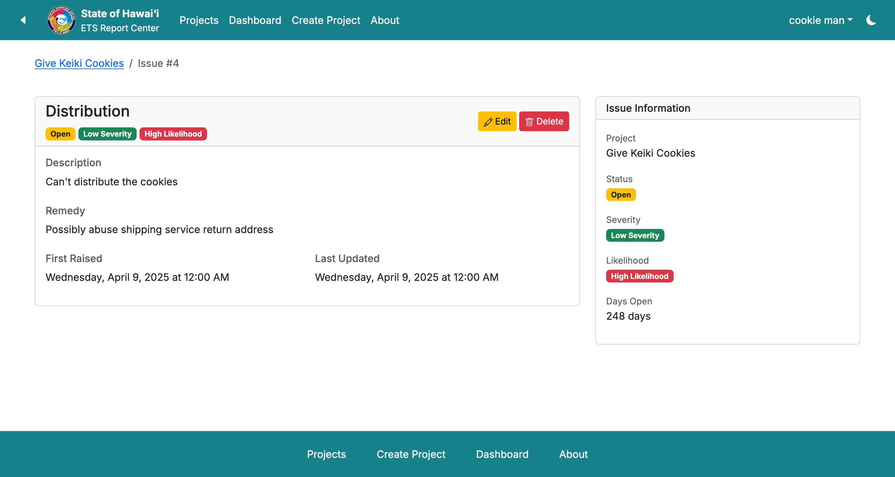
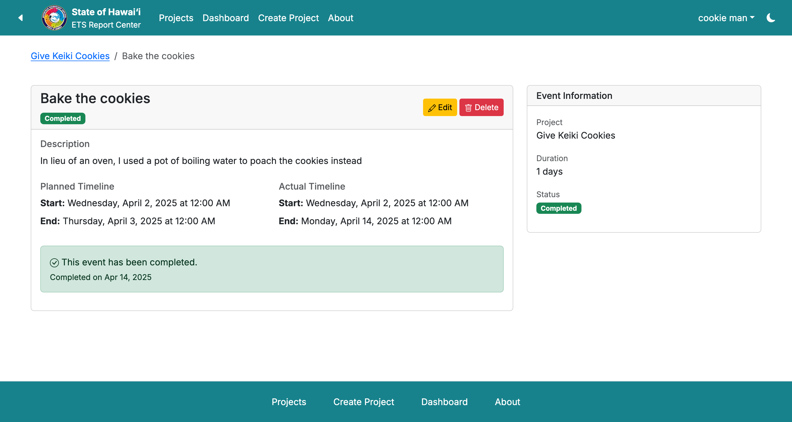

### ETS Employee View
This view is for the ETS employees. They can also see items listed under [public view](#public-view). They will be able to:

* View submissions of new projects and issues from vendors

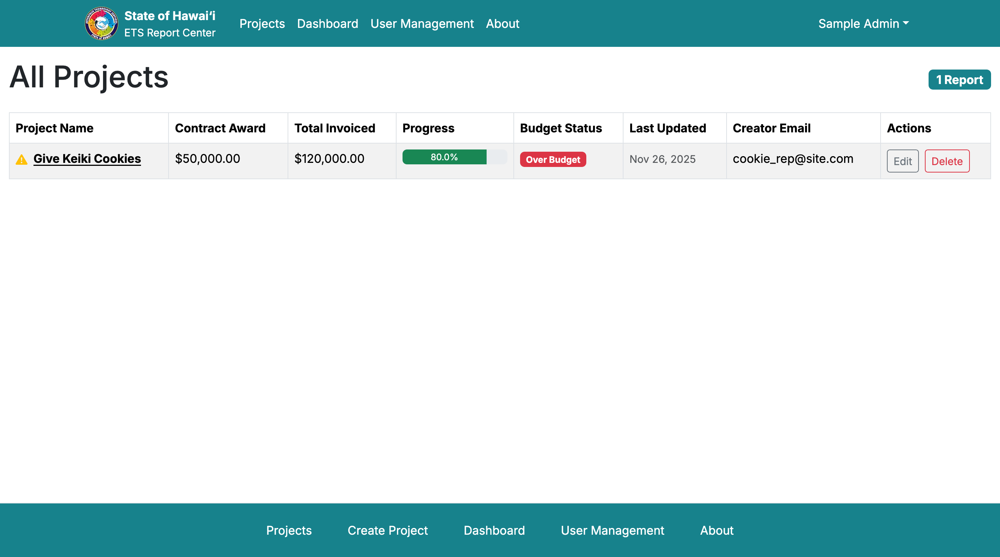

* Approve/reject existing projects and reports

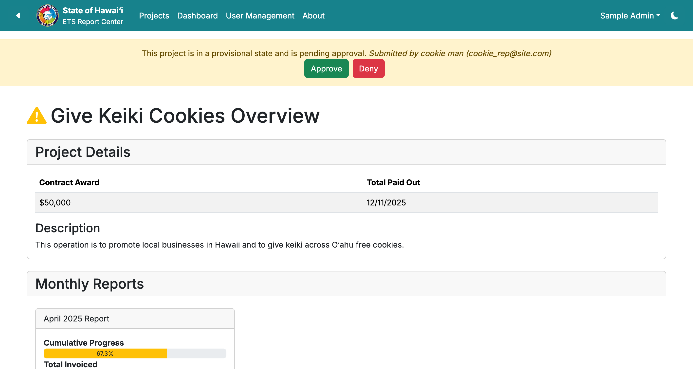
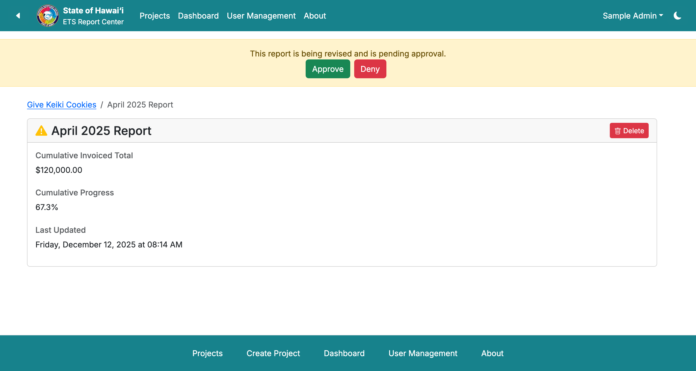

* Create and manage ETS or vendor accounts

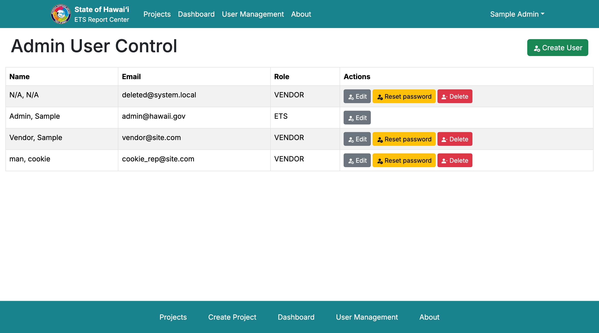

* Provide feedback to vendors on issues and projects

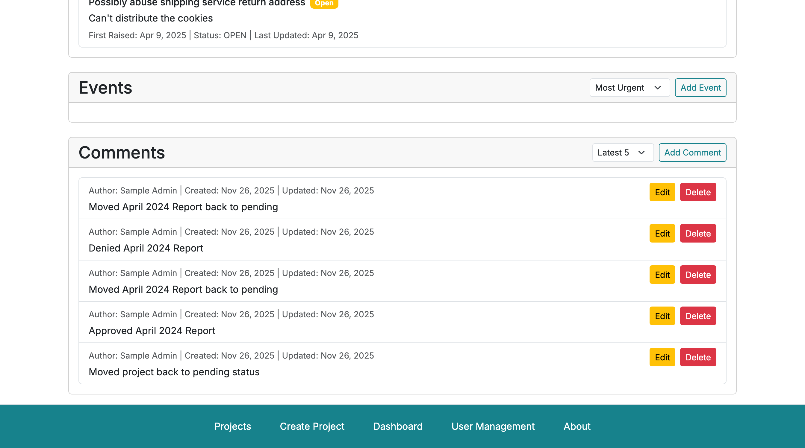

## Community Feedback

After sending out our application to a few evaluators, we received the following feedback:

### I liked:
* "*I like how professional it feels—it’s soulless exactly how a .gov website should be*"
* No loading bars – things just happened

### But (Future improvements):
* Should clean up items from the template, e.g. it doesn't make sense to have the login dropdown only contain one entry: the sign-in button.
* Make adjustments for mobile devices
* UI quality of life improvements: allow users to enter prices with commas
* Implement instant validation when filling out the various forms (e.g. events)
* Show more information on the dashboard page for a report

## Developer Guide

If you are interested in contributing to ETS, or running the website locally, follow the next sections.

### Installation

Make sure that you have [Node.js](https://nodejs.org/en) and [PostgreSQL](https://www.postgresql.org/) installed before continuing.

Now, fetch the source code from our [repository](https://github.com/oh-yeah-ics-314-final-project-7-lets-go/ets). Change your working directory to the folder containing the project and run the following command:
```
$ npm install
```

Make a copy of the `sample.env` file and adjust the `DATABASE_URL` key to point to a (presumably local) PostgreSQL database server. If you are not sure how to setup a PostgreSQL database, read [chapter 1](https://www.postgresql.org/docs/current/tutorial-start.html) of the documentation.

Now, you can run the project with
```
$ npm run dev
```

The website will be accessible at http://localhost:3000, NextJS will also show where the website is being hosted in the console window.

### Modifications

In the event that you want to modify or contribute to this project, you will find:

* Report forms: Under `/src/components`, then look for the appropriate folder. The bulk of our report forms are actually components as to not clash with server-side rendering. Our naming convention uses `<Action><Feature>Form.tsx` for the files. So, if you wanted to modify the create event form, you would find it under `/src/components/project/AddEventForm.tsx`.
* Directory structure: Our project uses the Next.JS [app router](https://nextjs.org/docs/app). That is, if you want to modify something like the projects page, you will find the appropriate file at `/src/app/projects/page.tsx`, not ` /src/app/projects.tsx`.

We have some additional rules when committing to our repository:
* Your last commit must have no ESLint errors (`npm run lint`), must pass the Next.JS build system (`npm run build`), and Playwright browser tests (`npx playwright test`).
* Variables are camelCase. Page name exports are PascalCase.

ESLint will usually sort out readability errors, so we don't have a rigorous styling guide yet.

### Browser Tests

Testing is done with Playwright. You can run the browser tests with the following command:

```
$ npx playwright test
```

If all goes well, all tests should pass. You may need to first install the browsers required for testing with:

```
$ npx playwright install
```