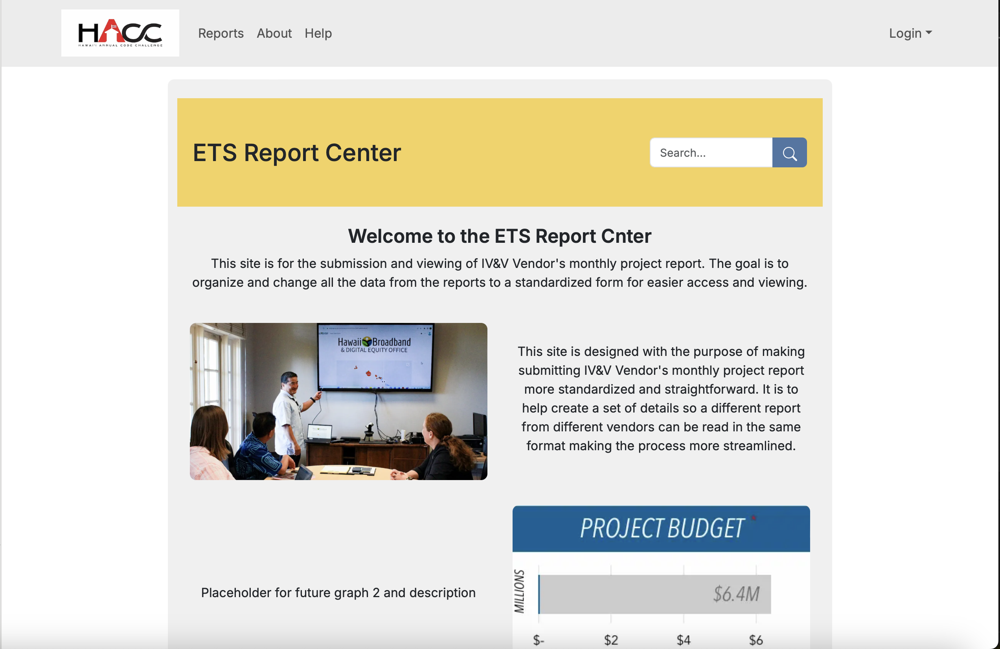
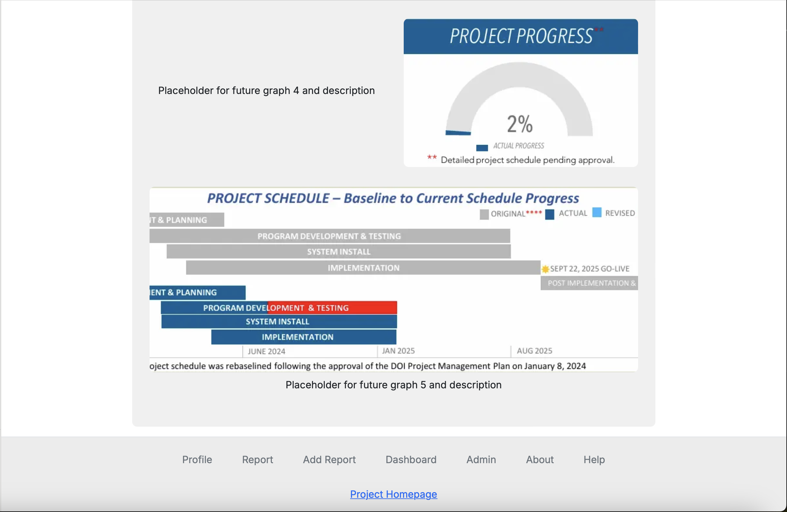
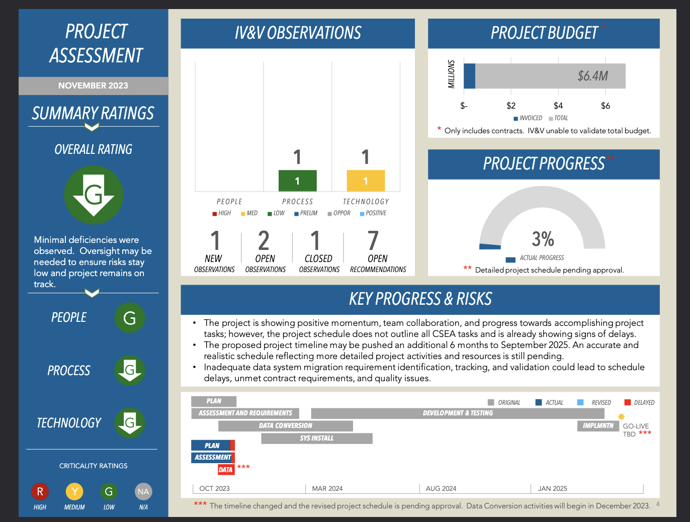
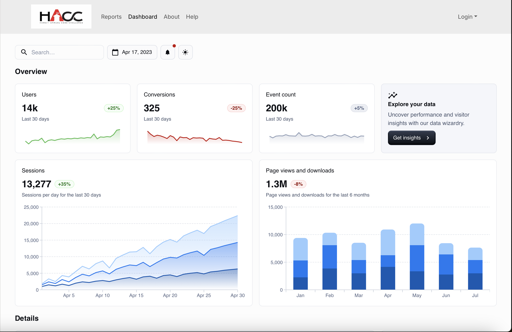
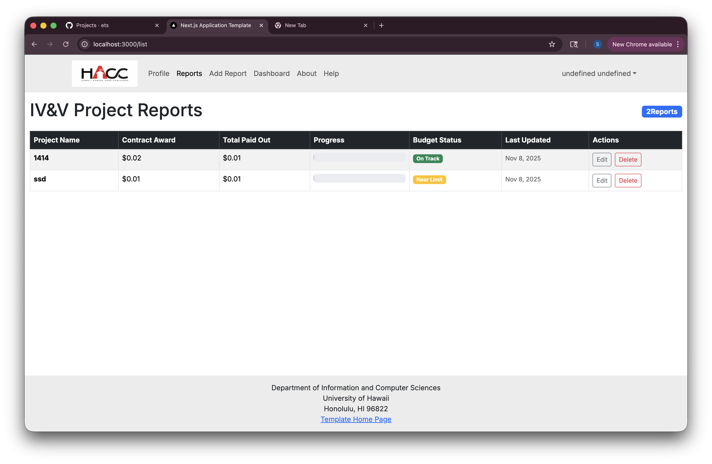

# ETS

(pending group & project name)

## About ETS

ETS gives ease of access for ETS employees to review and create projects reports sent in by the state's Independent Verification and Validation (IV&V) vendors by standardizing the information sent in by each vendor.

You can read more in the HACC proposal listed [here](https://hacc.hawaii.gov/wp-content/uploads/2025/10/Challenge-Use-Case-2025-ETS-Project-Review-Web-Application.pdf).

## Maintainers
* [Kyler Ching](https://github.com/kylersm)
* [Courtney Hisamoto](https://github.com/CourtneyHisa)
* [Zhanpeng Lin](https://github.com/zhanpenglin9)
* [Shuto Nishida](https://github.com/shuton-gif)

[*bound by agreement contract*](https://docs.google.com/document/d/1umOiaQro4WNHh2q9xjLKDcvKRWewYVYl2126YHVgowA)

## Tools

Our solution is based upon the [nextjs-application-template](https://github.com/ics-software-engineering/nextjs-application-template). For our stack, we are using:
* NextJS as our React framework
* Typescript for our backend and frontend
* React-Bootstrap for styling
* Prisma for ORM
* ESLint and Prettier for internal readability

## User Guide

This section aims to guide the user through how to use our website. Account creation is accessible to ETS employees only.

### Public View
This view is for the general public to see. They will be able to view:
* A list of every project submitted by the vendors. These projects will include issues, progress, budgets, and an overall timeline of the project.







### Vendor View
This view is for the IV&V vendors. They can also see items listed under [public view](#public-view). They will be able to:
* Create and edit projects
* Append, edit, or delete issues and timeline events to existing projects
* Receive feedback from ETS employees




### ETS Employee View
This view is for the ETS employees. They can also see items listed under [public view](#public-view). They will be able to:
* View submissions of new projects and issues from vendors
* Create and manage ETS or vendor accounts
* Provide feedback to vendors on issues and projects


## Developer Guide

If you are interested in contributing to ETS, or running the website locally, follow the next sections.

### Installation

Make sure that you have [Node.js](https://nodejs.org/en) and [PostgreSQL](https://www.postgresql.org/) installed before continuing.

Now, fetch the source code from our [repository](https://github.com/oh-yeah-ics-314-final-project-7-lets-go/ets). Change your working directory to the folder containing the project and run the following command:
```
$ npm install
```

Make a copy of the `sample.env` file and adjust the `DATABASE_URL` key to point to a (presumably local) PostgreSQL database server. If you are not sure how to setup a PostgreSQL database, read [chapter 1](https://www.postgresql.org/docs/current/tutorial-start.html) of the documentation.

Now, you can run the project with
```
$ npm run dev
```

The website will be accessible at http://localhost:3000, NextJS will also show where the website is being hosted in the console window.
